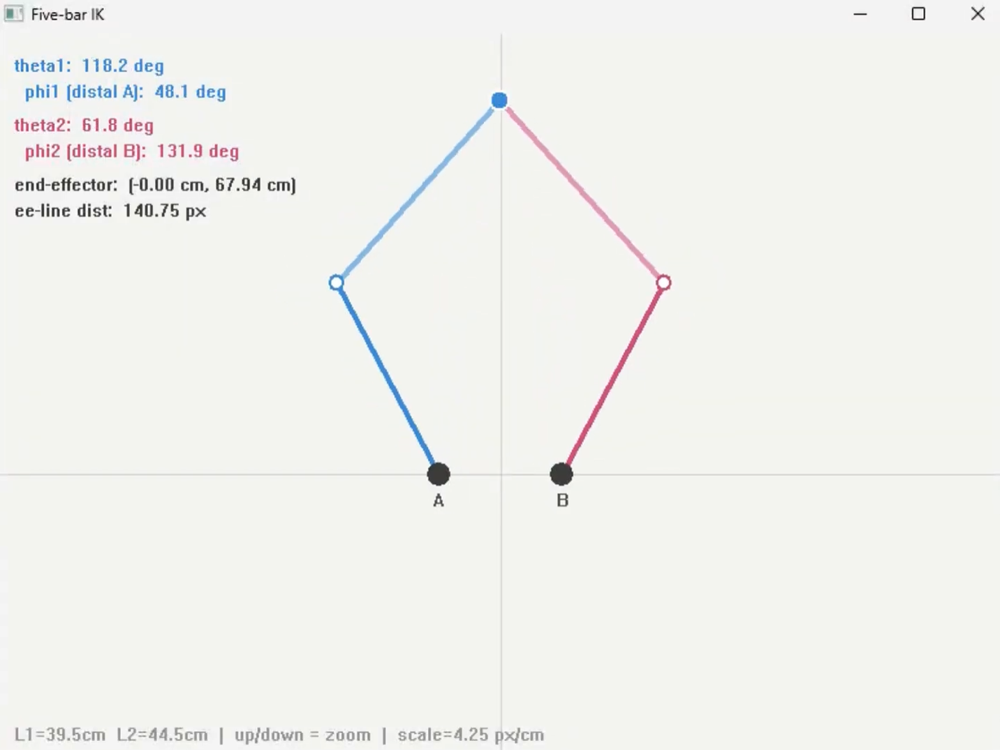
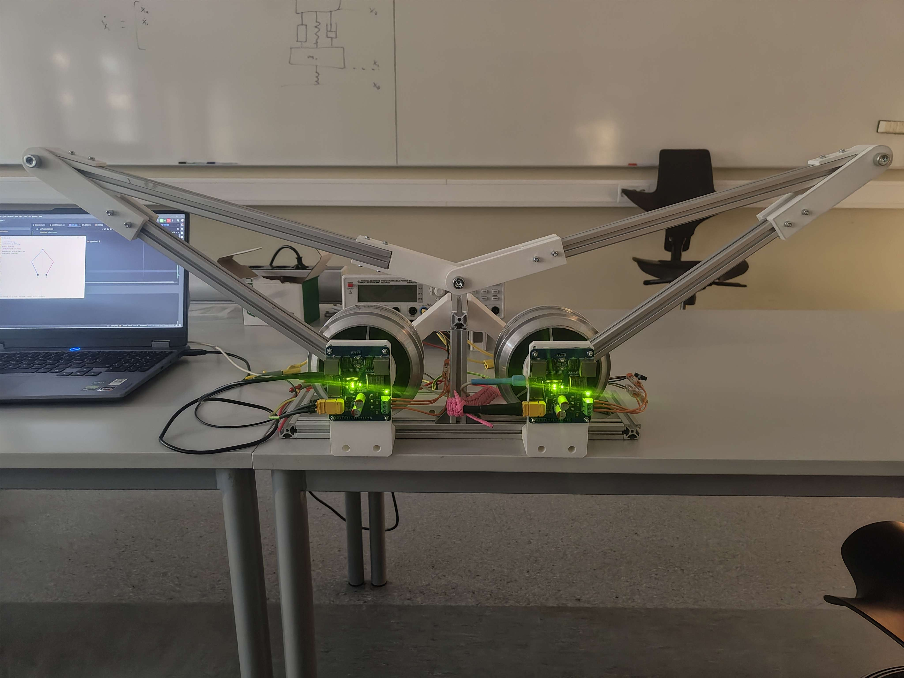

# IK SCARA Test

A real-time inverse kinematics demo for a five-bar parallel robot, driven by two [AthenaDrive]([https://github.com/ami-iit/paper_ramadoss_2022_ral_humanoid-base-estimation](https://github.com/IslandRock1/AthenaDrive)) FOC controllers over serial. The GUI lets you click a target position or run animations, and the IK solution is immediatly given as setpoints for the motors.

 

**Demo video:** [https://youtu.be/7aMmL1JBfC8]

---

## Hardware

| Component | Details |
|---|---|
| Robot configuration | Five-bar parallel linkage |
| Motor controller | AthenaDrive |
| Motor | Parallax 6.5″ Hub Motor |
| Connection | USB serial |
| OS | Windows (Win32 GUI) |

---

## How It Works

**Kinematics**

Each arm is a two-link chain solved independently with the law of cosines. Chain A uses elbow-up and chain B uses elbow-down, which is the correct configuration for a symmetric five-bar. A signed-distance check rejects solutions where the end-effector crosses the line between the two elbow joints, which filters out the flipped/invalid configuration.

Joint angles are constrained to 0–180 degrees. Any target outside the reachable workspace or that violates the joint limits is flagged as unreachable in the GUI.

**Motor output**

Encoder zero corresponds to the arm pointing straight up (90 degrees in the robot coordinate frame), so each computed angle is offset by -90 degrees before being sent as a position setpoint. Motor commands are rate-limited with a queue depth check to avoid flooding the serial buffer.

> **Note on mechanical setup:** The magnet placed on the motor output shaft must be parallel to and roughly centered on the encoder sensor at all times. The mechanical alignment of the feedback sensor needs to be precise and stable, because any wobble or offset will directly effect encoder accuracy and lead to unreliable and suboptimal actuation.

**Blending**

All target transitions (click or animation start) use a smoothstep ease-in/out blend so the arm accelerates and decelerates smoothly rather than snapping between positions.

---

## GUI Controls

| Input | Action |
|---|---|
| Left click / drag | Move end-effector to cursor position |
| Up / Down arrow | Zoom in or out (px/cm scale) |
| Left / Right arrow | Decrease or increase animation speed |
| `1` | Horizontal line sweep |
| `2` | Vertical line sweep |
| `3` | Square |
| `4` | Triangle |
| `5` | Circle |
| `6` | Figure-8 |
| `7` | Heart |
| `0` | Stop animation |

The info panel (top left) shows theta1, theta2, distal link angles phi1 and phi2, end-effector position in cm, and current animation state.

---

## Building

Requires a C++17 compiler and the [SerialComm](https://github.com/ami-iit/serial_cpp) library. Windows only due to Win32 GUI.

```bash
mkdir build && cd build
cmake ..
cmake --build .
```

Update the COM port strings in `main.cpp` to match your setup before building.

---

## Configuration

Motor parameters are set in `main.cpp` at startup:

```cpp
motorA.setNumPolePairs(15);
motorA.setCurrentLimit(10000);
motorA.setPositionKp(10.0);
motorA.setPositionKi(0.005);
motorA.setVelocityKp(5.0);
motorA.setDrivingMode(Position);
motorA.setTorqueSign(-1.0f);
```

Link lengths `L1` and `L2` (in cm) and `BASE_SEPARATION` are defined in `ik.hpp`. Adjust these to match your physical robot before running. For best performance should all 3 controllers (Position, Velocity and Torque) be optimiced.

---

## Project Structure
 
```
IK_SCARA_Test/
├── main.cpp
├── CMakeLists.txt
├── include/
│   ├── GUI.hpp
│   ├── IK.hpp
│   └── animation.hpp
└── src/
    ├── CMakeLists.txt
    ├── GUI.cpp
    ├── IK.cpp
    └── animation.cpp
```
 
---

## References

- [Levi Jannsen](https://www.youtube.com/watch?v=seqhnGhm_EM)
- [SerialComm](https://github.com/IslandRock1/AthenaDriveSerialExample)
- [Five-bar parallel robot kinematics](https://en.wikipedia.org/wiki/Five-bar_linkage)
